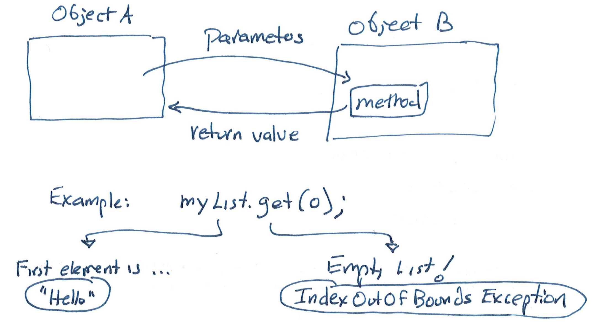

# Web APIs and Integration Testing with Mocks

This chapter combines some notes from Fall 2025 and Spring 2025. As such, it will have examples in both TypeScript and in Java. 

## Web APIs

There's a lot of useful information out there on the web.  One way we might work with that info is to _scrape_ websites: write a script that interacts with the HTML on a webpage to extract the info.

### Why Not Web Scraping?

What are some weaknesses of web scraping, from the perspective of both the person doing the scraping, and the person who is running the website?

<details><summary><B>Think, then click!</B></summary>
    
A few issues might be:
* The owner of the data might want to charge for access in a fine-grained way, or limit access differently from the way it works on a webpage. 
* Web scraping is unstable. If a site's format changes, web-scraper scripts can break. APIs can have breaking changes too, but when they do, the changes usually come with a warning to users!
* Web scraping is mostly a one-sided effort. While a site designer might work to ease the job of web scrapers, details can still require some guesswork on the part of the script author.
</details>

It turns out that ideas from web-scraping will remain useful though, when we get to testing front-end applications in a few weeks.

### Web APIs

APIs work like this: the user sends a structured request to the API, which replies in a documented, structured way. API is short for _Application Programming Interface_, and often you'll hear the set of functions it provides to users called the "interface". 

This is an example of an "interface" in the broad, classical sense. It isn't a _Java_ `interface`. It's one of many ways for two programs to communicate across the web, but it's _specific_ and _well-defined_.

APIs are everywhere. Whenever you log in via Google (even on a non-Google site) you're using [Google's Authentication API](https://developers.google.com/identity). 

APIs are very like method calls! The pictures are very similar:

 

The differences are in the ways we go about making a call (and processing the result). E.g., we have to build a request string that embodies the call, and we have to turn the response object into usable data.

### Example: National Weather Service

Let's start right away with a serious, high-volume API: the U.S. National Weather Service. These APIs tend to be [well-documented](https://www.weather.gov/documentation/services-web-api). We'll use the NWS because, while many professional APIs require registration and the use of an API key to use them, the NWS API is free and requires no registration. 

The NWS API is not the exact API you will be using on the sprint, but I like it for demonstrating the same kind of interaction you'll need to implement.

Let's get weather information for Providence. Our geocordinates here are: `41.826820`, `-71.402931`. According to the docs, we can start by sending a `points` query with these coordinates: [https://api.weather.gov/points/41.8268,-71.4029](https://api.weather.gov/points/41.8268,-71.4029):

#### Queries 

There are a few things to notice right away. First, the URL we sent had a _host_ portion (`https://api.weather.gov`) and an _endpoint_ (called, confusingly, `points`) that represents the kind of query we're asking. Then there are _parameters_ to the query (`41.8268,-71.4029`). 

~~~admonish note title="Why 4 significant digits, rather than 6, which is what we might see in the browser?"
Because last year, the API would give an error if we tried to provide 6 significant digits. So we truncate. 
~~~

#### Responses

We get this back:

```
{
    "@context": [
        "https://geojson.org/geojson-ld/geojson-context.jsonld",
        {
            "@version": "1.1",
            "wx": "https://api.weather.gov/ontology#",
            "s": "https://schema.org/",
            "geo": "http://www.opengis.net/ont/geosparql#",
            "unit": "http://codes.wmo.int/common/unit/",
            "@vocab": "https://api.weather.gov/ontology#",
            "geometry": {
                "@id": "s:GeoCoordinates",
                "@type": "geo:wktLiteral"
            },
            "city": "s:addressLocality",
            "state": "s:addressRegion",
            "distance": {
                "@id": "s:Distance",
                "@type": "s:QuantitativeValue"
            },
            "bearing": {
                "@type": "s:QuantitativeValue"
            },
            "value": {
                "@id": "s:value"
            },
            "unitCode": {
                "@id": "s:unitCode",
                "@type": "@id"
            },
            "forecastOffice": {
                "@type": "@id"
            },
            "forecastGridData": {
                "@type": "@id"
            },
            "publicZone": {
                "@type": "@id"
            },
            "county": {
                "@type": "@id"
            }
        }
    ],
    "id": "https://api.weather.gov/points/41.8268,-71.4029",
    "type": "Feature",
    "geometry": {
        "type": "Point",
        "coordinates": [
            -71.402900000000002,
            41.826799999999999
        ]
    },
    "properties": {
        "@id": "https://api.weather.gov/points/41.8268,-71.4029",
        "@type": "wx:Point",
        "cwa": "BOX",
        "forecastOffice": "https://api.weather.gov/offices/BOX",
        "gridId": "BOX",
        "gridX": 64,
        "gridY": 64,
        "forecast": "https://api.weather.gov/gridpoints/BOX/64,64/forecast",
        "forecastHourly": "https://api.weather.gov/gridpoints/BOX/64,64/forecast/hourly",
        "forecastGridData": "https://api.weather.gov/gridpoints/BOX/64,64",
        "observationStations": "https://api.weather.gov/gridpoints/BOX/64,64/stations",
        "relativeLocation": {
            "type": "Feature",
            "geometry": {
                "type": "Point",
                "coordinates": [
                    -71.418784000000002,
                    41.823056000000001
                ]
            },
            "properties": {
                "city": "Providence",
                "state": "RI",
                "distance": {
                    "unitCode": "wmoUnit:m",
                    "value": 1380.4369590568999
                },
                "bearing": {
                    "unitCode": "wmoUnit:degree_(angle)",
                    "value": 72
                }
            }
        },
        "forecastZone": "https://api.weather.gov/zones/forecast/RIZ002",
        "county": "https://api.weather.gov/zones/county/RIC007",
        "fireWeatherZone": "https://api.weather.gov/zones/fire/RIZ002",
        "timeZone": "America/New_York",
        "radarStation": "KBOX"
    }
}
```

This _wasn't nicely formatted_ for human reading. Why? Because it's meant for programs to consume. This string should bear a remarkable resemblance to TypeScript objects. It's called Json: _JavaScript Object Notation_. When we write programs that work with web APIs, we'll never manually parse these, we'll use a library that does it for us. In general:
* when we're converting data or an object in our program to a format meant for transmission (like Json) we'll call it _serialization_; and
* when we're converting a transmission format (like Json) into data or an object in our program, we'll call it _deserialization_.

What else do you notice about this data? 

<details>
<summary>Think, then click!</summary>
    
One thing is: **you can ignore a lot of it**. This first query gives us useful information for _further_ uses of the API. Another is that there's no actual weather information here...
    
</details>
</br>

See the documentation to understand the meaning of specific fields in the response. At a high level, this query tells us _which NWS grid location_ Providence is in, along with telling us URLs for common queries about that grid location. The NWS API needs you to work with it in stages. 

## Building API Servers

We've provided a number of examples of setting up an API server. Whether we're doing this in Java or TypeScript, the flow of our _proxy server_ for weather will look roughly like this:
* When our server starts up, it listens for requests on a set of endpoints. We need to register an endpoint (for callers to make weather requests) and a _handler_ callback for the server to call when it gets a request. 
* When someone sends our API server a request for the weather, it passes the request to the handler we gave it.
* The handler sends a request of its own to the NWS, asking what their grid coordinates are for the geo-location given.
* The handler sends a second request to the NWS for the forecast at that location. 
* Once the forecast is received, the handler assembles a JSON response and sends it back to the original caller&mdash;reporting the weather forecast.

You can see a much-simplified version of this loop in my example [Providence Weather app](). The source code is ([here](https://github.com/tnelson/pvd-weather)). 

```admonish note title="This was a summer Copilot project"
This was one of the first things I built with Copilot over the summer, as I was working on the course. The [README file](https://github.com/tnelson/pvd-weather/blob/main/README.md) in the repo has some notes about how it went. Copilot was great for building the initial prototype, but had some trouble with the structure of the JSON it needed to process and adding TypeScript types.
```

<!-- ### Setting up a server

We'll use a library called Sparkjava to run our API servers. Sparkjava is relatively simple to set up: we just tell it which port to use (here, `3232`), which endpoints to listen at, and for each, a handler object (there's the strategy pattern again!) that processes requests.

~~~admonish warning title="Sparkjava came first, but..."
If you Google for 'spark', you're likely to get answers related to [Apache Spark](https://spark.apache.org), a more popular library that happens to be for data science, not web servers. Watch out!
~~~

In the livecode for today, you'll see the entry point in the `Server.java` file. The code looks something like this:

```java
private final WeatherDatasource state = new NWSAPIWeatherSource();
Spark.port(port);
Spark.get("/weather", new WeatherHandler(state));
Spark.awaitInitialization();
```

In this case, the `WeatherHandler` object's constructor takes a _data source object_. Why do you think that is? 

<details>
<summary>Think, then click!</summary>
    
Extensibility and testing! If we added more handlers, we'd probably need to share some state between them. This sort of _dependency injection_ allows us to do just that. We might even wrap the datasource in a class that holds other kinds of state or other data sources.
    
</details>

Each of these handler classes handles queries sent to a specific endpoint. Here, queries to `weather` are handled by a `WeatherHandler` object.

You might notice that the data source being created is a `NWSAPIWeatherSource`, but it's being used only by an interface, `WeatherDatasource`. This enables some very useful techniques, including better testing.  -->

### Testing API Servers: Example of Integration Testing

Our philosophy is generally that you'll be able to test most everything you do. So: **how can I test my API server?**

One way is to write unit tests. E.g., if we have a CSV data source (hint: you do!), we should have unit tests for that. If we have a source that goes to the National Weather Service to fetch forecasts, we should test that. 

But neither of those will test the _handlers_, or anything between the handler and the data source. We need to test the combination of a number of units: the code that accesses the data source, code (if any) that processes the raw data, the API handlers of our server, etc. When you're testing the _integration_ of multiple components in your application (such as our server tests) this is called _integration testing_. 

The gearups contain examples of how to set this up. In brief, you start up the server and send "fake" API queries as part of each of your test cases. Then each test looks at the responses and decides whether they are good or bad.

<!-- One way, which is what we did in prior semesters, is to write a test class that starts up our server locally, sends it web requests, and evaluates the response&mdash;all done on the local computer, no Internet connection needed. In Spring 2025, we're instead using a tool called Postman, which can help us script API requests and examine responses. For the moment, we'll just use it as a library of example queries that we can manually inspect results for.  -->


### Mocking (a remarkably powerful technique)

Consider what happens when I run integration tests. These generate web requests to our server, and then (assuming normal operation), our server will send a series of web requests to the NWS API. This is reasonable, but has a number of problems. What issues have I introduced into my testing because *running the tests requires the NWS API*?

<details>
<summary>Think, then click!</summary>
    
At the very least, the more I test (and I should test often!), the more I'll be spamming the NWS with requests. If I do it too much, they might think I am running a denial-of-service attack on them, and rate limit my requests. I also just can't run my test suite without an Internet connection, or if the NWS is down for maintenance. 
    
(There are other reasons, too.)
    
</details>

You'll use mocking in every sprint from now until the class is over; we've only barely discovered how important it is as a technique. And the patterns we have learned so far are perfect for implementing mocking well. To start with, a data source can be a strategy provided by the caller (real or mock). 

The [Mocking example](https://github.com/cs0320/class-livecode/tree/main/F25/sep25_mocking_brain_jar) from the live code shows one way to do this. You can also use Jest or Playwright themselves to mock certain functionality like input and output. 

```admonish note title="Why does the example not just use a testing framework?"
A more conceptual example can demonstrate generally useful ideas like dependency injection without tying them to how those ideas are used by a specific library. In particular, notice how dependency injection here is just passing an argument to a factory function. 
```

