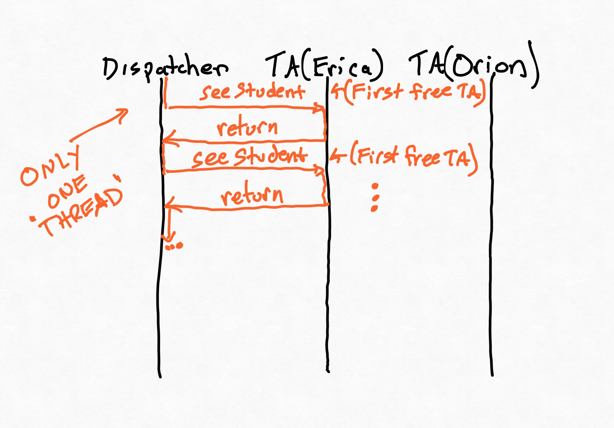
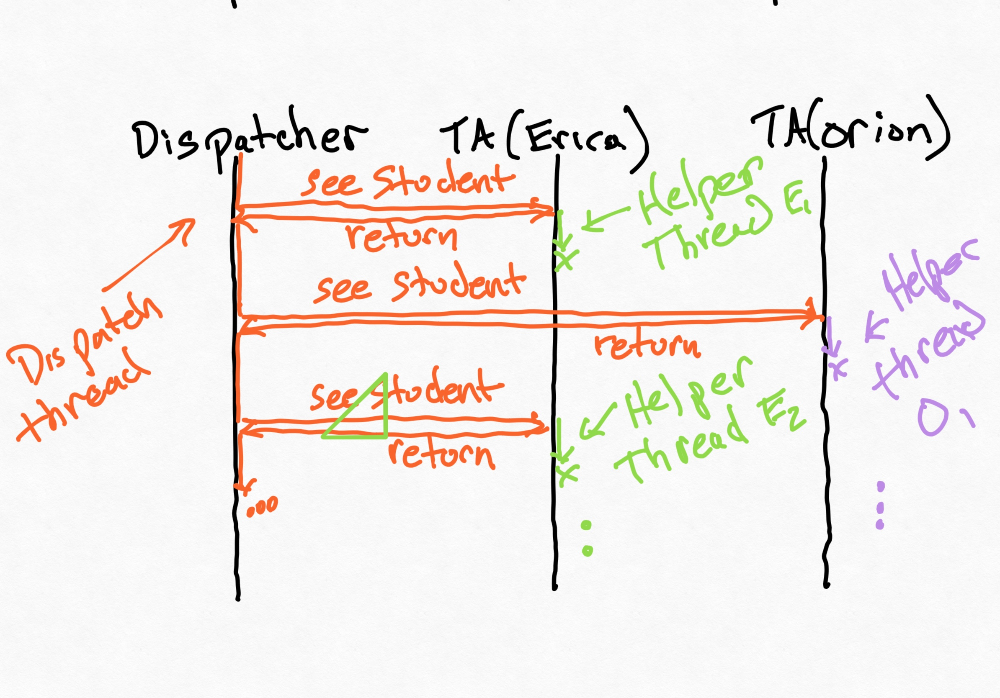

# Threads and Promises

The material in these notes goes deeper than we can cover in class. If you're having issues with concurrency, parallelism, or asynchronous execution: **read these notes**! If you're having trouble with the difference between promises and threads, **read these notes!**

## Motivating Concurrency

Let's go back to the hours queue dispatcher. You can find a more complete version of the example in the project linked at the beginning of these notes.

If we run the `main` method in the `Main` class of this new example, we'll get something like this (using TA names from a prior semester):

```
08:45:09:837 Dispatcher: Welcome to edu.brown.cs32.livecode.threads.TA hours!
08:45:09:839 Dispatcher: Hi Nim; you'll be seen by Erica
08:45:09:844 Erica says: Hello Nim!
Erica says: Goodbye Nim, I hope that helped!!
08:45:10:859 Dispatcher: Hi Alice; you'll be seen by Erica
08:45:10:859 Erica says: Hello Alice!
Erica says: Goodbye Alice, I hope that helped!!
08:45:11:865 Dispatcher: Hi Bob; you'll be seen by Erica
08:45:11:865 Erica says: Hello Bob!
Erica says: Goodbye Bob, I hope that helped!!
08:45:12:870 Dispatcher: Hi Charli; you'll be seen by Erica
08:45:12:871 Erica says: Hello Charli!
Erica says: Goodbye Charli, I hope that helped!!
08:45:13:876 Dispatcher: Hi Boatswain; you'll be seen by Erica
08:45:13:877 Erica says: Hello Boatswain!
Erica says: Goodbye Boatswain, I hope that helped!!
08:45:14:882 Dispatcher: Hi Bucky; you'll be seen by Erica
08:45:14:882 Erica says: Hello Bucky!
Erica says: Goodbye Bucky, I hope that helped!!
08:45:15:887 Dispatcher (6 helped so far): Nobody waiting in queue, will check again in three seconds.
```

Until we look at the timestamps, this seems fine.

This doesn't look so great. We have some problems to solve. If you look at the code, you might see other problems too. Here are three:
* Challenge 1: the dispatcher is waiting for _an individual TA_ to finish helping a student before allocating the next TA. Lots of TAs will be idle, and students will wait a lot longer.
* Challenge 2: maybe we'd like to add TAs while the dispatcher is running.
* Challenge 3: how can new students join the queue?

All of these problems are related to today's topic: _concurrency_:
* We'd like TAs to be able to help students without holding up the dispatcher from allocating other students to other TAs. _We need the dispatcher to run concurrently with the TAs._
* We need a way for the `Main` class to call `dispatcher.addTA()` after the dispatcher starts running. But right now, there's no way for the `Main` class to run independently of the dispatcher. _We need the dispatcher to run concurrently with the `main()` method._
* We need a way for new students to be added to the queue. This is the same problem as above!

Concerns like these pop up all the time in engineering. (The problem isn't just that the way I've written the dispatcher library is not very realistic.)

Here's a picture demonstrating the current state of affairs. These are called _sequence diagrams_, and they are very common in networking and distributed systems. Each vertical line corresponds to an entity (in this case, 3 different classes). Horizontal lines are messages or method calls. We can see the control flow, in a single thread, passing between the classes. Because `Erica` is always the first free TA in the list whenever the dispatcher gets to go, `Erica` is the only TA who gets to see students.



## How does concurrency help us?

A program is _concurrent_ if it involves multiple simultaneous threads of execution. Note that this doesn't necessarily mean that these multiple threads really are running at the same time, just that they are "executing". We will make a distinction in this class between concurrency and _parallelism_, where threads really are executing at the same time, usually on multi-core hardware or in the cloud. **A parallel program is always concurrent, but the threads of a concurrent program may or may not actually be run in parallel.**

To illustrate this idea, consider what your computer is doing right now. You're probably running more programs than you can count, even before you think about what your operating system is doing. How many CPU cores do you have? Probably not more than a dozen (and likely fewer). So not all of the concurrency that's happening can be parallelized: you'd need hundreds of cores for that! Instead, your operating system runs a _scheduler_ program which allocates slices of time to different threads of execution. 

Concurrency is more common than you might imagine. Because we're working with Java, _every_ program you write is concurrent, even a "Hello World!" program. Why?
<details>
<summary><B>Think, then click!</B></summary>

The garbage collector!

</details>

### Using concurrency to get what we want

Imagine logically splitting our big program into separate, independent "threads" of execution: one that runs the dispatcher, another that runs when a TA helps a student, and so on. We just need to separate them from each other, and help them communicate.

So far we've only had one thread: the one that starts up in our `main` method. How do we get another, and which should it correspond to?

<details>
<summary><B>Think, then click! (Image within...) </B></summary>

There are a few options. But let's start simply, and not try to solve _all_ the challenges at once. We'll have every TA correspond to their own thread, and have those threads woken up by the dispatcher. it would look something like this:



*The triangle is a drawing error I need to remove, but I ran out of time before class. :-)*

</details>

### Runnables and Threads

Java has an interface called `Runnable`, which requires the implementation of a `run()` method. It's also got a class called `Thread`, which has a constructor that accepts a `Runnable` and a method called `start()`. So, as a first cut, let's make `TA` implement `Runnable`, and whenever we dispatch a student to that TA, we run the thread.

```java
public class TA implements Runnable {
    // ...
    public void seeStudent(Student student) throws TABusyException {
        // ...
        new Thread(this).start(); // NOT the same as .run()
    }
    // ...
    @Override
    public void run() {
        // When the above .start() method is called, the *NEW THREAD* will execute this method.
    }
}
```


Now, when we run, we'll see:

```
09:24:18:642 Dispatcher: Hi Charli; you'll be seen by Erica
09:24:18:647 Dispatcher: Hi Boatswain; you'll be seen by Orion
09:24:18:647 Erica says: Hello Charli!
09:24:18:647 Orion says: Hello Boatswain!
Orion says: Goodbye Boatswain, I hope that helped!!
09:24:19:652 Dispatcher: Hi Bucky; you'll be seen by Orion
09:24:19:652 Orion says: Hello Bucky!
Erica says: Goodbye Charli, I hope that helped!!
09:24:19:653 Dispatcher: Hi Nim; you'll be seen by Erica
09:24:19:653 Erica says: Hello Nim!
Orion says: Goodbye Bucky, I hope that helped!!
09:24:20:658 Dispatcher: Hi Alice; you'll be seen by Orion
Erica says: Goodbye Nim, I hope that helped!!
09:24:20:658 Dispatcher: Hi Bob; you'll be seen by Erica
09:24:20:658 Orion says: Hello Alice!
09:24:20:658 Erica says: Hello Bob!
09:24:20:658 Dispatcher (4 helped so far): Nobody waiting in queue, will check again in three seconds.
Orion says: Goodbye Alice, I hope that helped!!
Erica says: Goodbye Bob, I hope that helped!!
09:24:23:662 Dispatcher (6 helped so far): Nobody waiting in queue, will check again in three seconds.

```

Much better! 

### Concurrency vs. Parallelism (Again)

The `TA` thread and the main thread really are running separately. It's not clear whether they are truly running _in parallel_, though: the operating system and Java runtime decide that, in part based on how many cores the hardware has available. 

## What Could Go Wrong?

Concurrency seems really powerful. But are there any risks associated with it? Let's investigate. 

Suppose we want to record how many students have been seen before the dispatcher terminates. One natural way to do this is by adding a `static` counter to the dispatcher class:

```java
static int studentsSeen = 0;
```

Now, every `TA` can increment this counter in its `run` method, when the student has been helped:

```java
HoursDispatcher.studentsSeen += 1;
```

If we tell the dispatcher to print this counter out, we'll see output like this at the end of the queue:

```
11:56:10 Dispatcher: Nobody waiting in queue, will check again in three seconds. So far we helped 6 students.
```

And indeed that's what we see. But let's see how this works _at scale_. Instead of using these names, we'll create a hundred TAs, and a few thousand students who need to be helped! 

So that we can simulate helping so many students without waiting, let's reduce the delay time to help a student: students will be helped instantaneously! We'll also remove the printing in the `TA` class, since that slows things down. 

We might see something like this:

```12:10:52 Dispatcher: Nobody waiting in queue, will check again in three seconds. So far we helped 299993 students.```

Uh oh.

What's going on? (By the way, this issue might be less likely to happen if we left the printing in.)

<details>
<summary>Think, then click!</summary>

I've made the classic _thread safety_ mistake. Incrementing that counter isn't _atomic_: two threads might be trying to edit it at once. Suppose they both fetch the current value at once, add 1 to that value, and then write. If that sequence of operations happens, the counter will only be increased by one.
</details>
</br>

This sort of issue is _pervasive_ in multi-threaded programming. Do the reading---you'll save yourselves a lot of pain.

## How Can We Fix This?

The first approach is old-school synchronization:

```java
synchronized (HoursDispatcher.class) {
    HoursDispatcher.studentsSeen += 1;
}
```

This will tell Java that only one `TA` can be running that increment operation at a time. (The argument to `synchronized` helps disambiguate between multiple dimensions of synchronization we might have happening).

Another approach is to use _thread safe objects_ from Java's standard library. In particular, I could have used an `AtomicInteger` for the counter:

```java
static AtomicInteger studentsSeen = new AtomicInteger(0);
// ... 
HoursDispatcher.studentsSeen.incrementAndGet();
```

Both of these approaches fix the problem. The key takeaways are:
* Having multiple threads of execution lets a program better separate responsibilities into different execution paths that run at the "same time", logically speaking.
* These threads might _actually_ be run at the same time, but, depending on the operating system, they might be run by time-slicing (i.e., taking turns on one core). 
* Concurrency can cause unusual bugs that don't always happen, or that happen differently across executions. Situations where the ordering of operations results in inconsistent behavior are called _race conditions_.

## Asynchronous Execution

Let's get back to TypeScript. TypeScript has _really_ convenient support for concurrency. Try these in the browser console:

```
console.log('1')
setTimeout(() => console.log('2'), 5000)
console.log('3')
```

But just under that surface, complexity lurks:

```
console.log('1')
setTimeout(() => console.log('2'), 5000)
console.log('3')
while(true) {}
```

What's happening here? JavaScript&mdash;a language built for the web&mdash;is a language whose design is _deeply and unavoidably_ tangled with concurrency. 

And yet, JavaScript itself (barring [some modern extensions](https://developer.mozilla.org/en-US/docs/Web/API/Web_Workers_API/Using_web_workers), which are best used for expensive tasks that would block important things like UI interactivity) is **only single-threaded**.  We don't create a new thread to wait for a web request to finish. Instead, we create a callback, like we would for a button being clicked. 

In principle, callbacks are _called_ as soon as possible. But the definition of "as soon as possible" is complicated. The browser is in charge (or Node is, if you're running a backend server).

### The Callback Queue

Because TypeScript is single threaded, it can't actually invoke a callback while it's running some other piece of code. It has to wait until that code finishes, and then it looks at its _callback queue_ to see if it has callbacks waiting to be processed.

Every time a callback is registered (in the `setTimeout` example above, the 0-argument function that invokes `console.log` is a callback) it is added to the queue. Crucially, these calls will only ever take place if they're popped off the queue. And they're only ever removed when the code currently being executed is finished. 

This will become extremely important when you start sending web requests from your frontend to your API server. **Callbacks are not threads**. Asynchronous execution is very closely related to concurrency, however. 

~~~admonish warning title="Repeating for emphasis"
**Callbacks are not threads.** Neither are promises, `async` functions, or anything else in the remainder of these notes. 
~~~

## Code Review Exercise

Let's look at some code and anticipate potential errors related to concurrency. (I've removed the types so that we can run this in the browser console.) What's the value that you expect to be printed by this code?

```javascript
function sayHello(){
    let toReturn = 0
    setTimeout(() => {
        toReturn = 500
    }, 0)
    setTimeout(() => {
        toReturn = 100
    }, 5000)
    return toReturn
}
console.log(sayHello())
```

### Connecting to Sprint 2

Right now, you're working with file I/O. Because reading from or writing to a file can take time, _file I/O is asynchronous in TypeScript_. The `async` and `await` operators help us deal with asynchronous execution.

**In class, we'll look at this informally in my own CSV parser code.**

Next time, we'll introduce asynchronous execution in the context of making web requests. 

<!-- ### Fetching Data 

In TypeScript, you can use the `fetch` function to send a web request:

```typescript
export function printGridInfo() {    
    const lat: number = 39.7456
    const lon: number = -97.0892
    const url: string = `https://api.weather.gov/points/${lat},${lon}`
    console.log(`Requesting: ${url}`)

    /* 
      Try #1
    */
    const json = fetch(`https://api.weather.gov/points/${lat},${lon}`)
    console.log(json)
```

Thinking about what we just learned about concurrency, and what we know about TypeScript, do you expect `fetch` to be synchronous or asynchronous? That is, will it "block" execution until it finishes?

If it's synchronous, then the page-load process might be delayed noticably. And slowing down page loading to the point a user notices is a cardinal sin on the web: it's "in the folklore" that [a small delay can lead to a drop in revenue](https://news.ycombinator.com/item?id=273900).

But if it's asynchronous (i.e., doesn't block) then what will be printed? Hopefully not `undefined` or `null`&mdash;the data will almost certainly get here _eventually_. So `fetch` returns a datatype whose entire purpose is to represent data that doesn't yet exist: a _promise_.


A promise can either be _resolved_, in which case the value exists within (but the value is still a promise object, not the data!) or _rejected_, in which case the promise contains an error. Until either of those events occurs, the promise exists in a state of potential only.

**Aside:** Many modern languages have promise libraries, and promises are a common way to manage asynchronous computation (like web requests). This is not just about TypeScript or JavaScript.

But because of how JavaScript/TypeScript works, the promise _cannot be resolved_ until the current code finishes running. That is, the `console.log` statement can't print the right answer until _after the `console.log` executes_, because the right answer won't exist until then. 

But how does `console.log` work, then?"

<details>
<summary>Think, then click!</summary>

Because the _environment_ has multiple threads. This might be the browser, or it might be Node.js. It's only the execution of a JavaScript/TypeScript program that is single threaded. So we can see the update in the console before the currently-running code finishes.

</details>

Clearly, we need something to help make this work. 

### Extracting Promised Data with Callbacks

Promises can be given callback functions to run when they're resolved:

```javascript
// Make a web request...
fetch(url) 
    // ...and when the response arrives, print it to the console
    .then(response => console.log(response)) 
```

The function passed to the `then` call will execute once a real value exists for the response. The `.json()` method returns a promise itself, so we need to provide a callback for that, too, now: 

```javascript
fetch(url)
    .then(response => response.json()) 
    .then(responseObject => {         
           console.log(responseObject)         
    }) 
```

This is called a _chain_ of promises. Once the response is received, we convert it to an object. Once that conversion process is done, we print the result. 

You can find more examples like this in the livecode repository. We'll also talk more about them in the gearup for this upcoming sprint.

### What about types?

`Promise<T>` is a generic type in TypeScript. By default, `fetch` returns a `Promise<any>`---beware, here. The `any` type exists, at least in part, for interoperability with JavaScript, and it disables many checks involving computation "downstream" of the `any` value. 

**See the livecode for more content.** In particular, there's:
* a demo that reinforces how promises _are not threads_;
* a demo of some pitfalls when using async/await, if you choose to do so; 
* a more complete series of attempts to extract Json from a fetched response, including how to make narrowing easy.

We'll cover what we can in today's class session, but please read over the livecode too. I leave comments to try and make the livecode a good supplemental resource.

## What about `async` and `await`? 

TypeScript provides two constructs that can often make working with promises easier: `async` (which tells the system that the function actually returns a _promise_, even if as written it returns a value), and `await` (which tells the system to invisibly inject callbacks as needed to act as though it is waiting for a certain operation to finish). You'll have already seen these used heavily in Playwright testing, because `await` is very convenient to, well _await_ the loading of a webpage. 

The key is remembering that `await` can only be used within an `async` function, and an `async` function always returns a promise. So if I write something like:

```
const f = async (url) => {
    const response = await fetch(url)
    return response;
}
```

then the return type of `f` is actually `Promise<Response>`, not `Response`. You can confirm this via mouseover in VSCode, or by `console.log`.


As a consequence, if you use `async` and `await`, you end up either:
* putting all the pertinent functionality you care about in `async` functions after `await`s, and thus can totally ignore the return value; or 
* if you need to do something with the final return value outside an `async` context, use `.then()` on the return value&mdash;which, again, will be a promise outside an `async` context.  -->