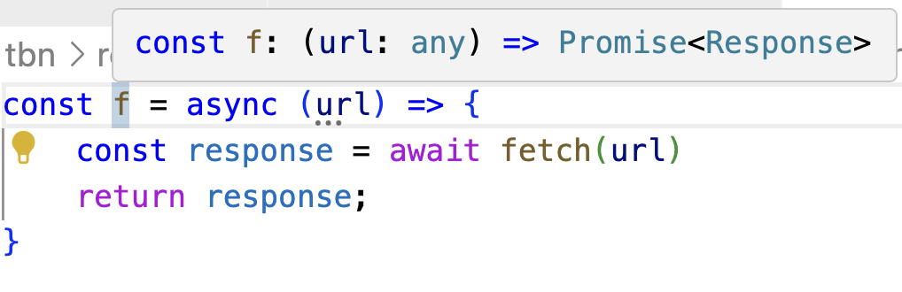

# TypeScript/JavaScript Asynchrony

## JavaScript "Concurrency"

Today's livecode will be in the repository under [oct17_ts_fetch](https://github.com/cs0320/class-livecode/tree/main/F24/oct17_ts_fetch). Get the code to follow along. There's also more examples in the repository than we can cover in a single class, so you might find it useful for reference as well.

On the surface, JavaScript has _really_ convenient support for concurrency. Try these in the browser console:

```
console.log('1')
setTimeout(() => console.log('2'), 5000)
console.log('3')
```

But just under that surface, complexity lurks:

```
console.log('1')
setTimeout(() => console.log('2'), 5000)
console.log('3')
while(true) {}
```

What's happening here? JavaScript&mdash;a language built for the web&mdash;is a language whose design is _deeply and unavoidably_ tangled with concurrency. 

And yet, JavaScript itself (barring [some modern extensions](https://developer.mozilla.org/en-US/docs/Web/API/Web_Workers_API/Using_web_workers), which are best used for expensive tasks that would block important things like UI interactivity) is _single threaded_.  We don't create a new thread to wait for a web request to finish. Instead, we create a callback, like we would for a button being clicked. 

In principle, callbacks are _called_ as soon as possible. But "as soon as possible" is complicated.

### The Callback Queue

Because TypeScript is single threaded, it can't actually invoke a callback while it's running some other piece of code. It has to wait until that code finishes, and then it looks at its _callback queue_ to see if it has callbacks waiting to be processed.

Every time a callback is registered (in the `setTimeout` example above, the 0-argument function that invokes `console.log` is a callback) it is added to the queue. Crucially, these calls will only ever take place if they're popped off the queue. And they're only ever removed when the code currently being executed is finished. 

This will become extremely important when you start sending web requests from your frontend to your API server. **Callbacks are not threads**. 

~~~admonish warning title="Repeating for emphasis"
Callbacks are not threads.
~~~

## Code Review Exercise

Let's look at some code and anticipate potential errors related to concurrency. (I've removed the types so that we can run this in the browser console.) What's the value that you expect to be printed by this code?

```javascript
function sayHello(){
    let toReturn = 0
    setTimeout(() => {
        toReturn = 500
    }, 0)
    setTimeout(() => {
        toReturn = 100
    }, 5000)
    return toReturn
}
console.log(sayHello())
```

## Fetching Data in TypeScript

In TypeScript, you can use the `fetch` function to send a web request:

```typescript
export function printGridInfo() {    
    const lat: number = 39.7456
    const lon: number = -97.0892
    const url: string = `https://api.weather.gov/points/${lat},${lon}`
    console.log(`Requesting: ${url}`)

    /* 
      Try #1
    */
    const json = fetch(`https://api.weather.gov/points/${lat},${lon}`)
    console.log(json)
```

Thinking about what we just learned about concurrency, and what we know about TypeScript, do you expect `fetch` to be synchronous or asynchronous? That is, will it "block" execution until it finishes?

If it's synchronous, then the page-load process might be delayed noticably. And slowing down page loading to the point a user notices is a cardinal sin on the web: it's "in the folklore" that [a small delay can lead to a drop in revenue](https://news.ycombinator.com/item?id=273900).

But if it's asynchronous (i.e., doesn't block) then what will be printed? Hopefully not `undefined` or `null`&mdash;the data will almost certainly get here _eventually_. So `fetch` returns a datatype whose entire purpose is to represent data that doesn't yet exist: a _promise_.


A promise can either be _resolved_, in which case the value exists within (but the value is still a promise object, not the data!) or _rejected_, in which case the promise contains an error. Until either of those events occurs, the promise exists in a state of potential only.

**Aside:** Many modern languages have promise libraries, and promises are a common way to manage asynchronous computation (like web requests). This is not just about TypeScript/JavaScript.

But because of how JavaScript works, the promise _cannot be resolved_ until the current code finishes running. That is, the `console.log` statement can't print the right answer until _after the `console.log` executes_, because the right answer won't exist until then. 

~~~admonish note title="But how does `console.log` work, then?"
Because the _browser_ has multiple threads. It's only JavaScript evaluation that is single threaded. So we can see the update in the browser console before the currently-running JavaScript finishes. 
~~~

Clearly, we need something to help make this work. 

### Extracting Promised Data with Callbacks

Promises can be given callback functions to run when they're resolved:

```javascript
// Make a web request...
fetch(url) 
    // ...and when the response arrives, print it to the console
    .then(response => console.log(response)) 
```

The function passed to the `then` call will execute once a real value exists for the response. The `.json()` method returns a promise itself, so we need to provide a callback for that, too, now: 

```javascript
fetch(url)
    .then(response => response.json()) 
    .then(responseObject => {         
           console.log(responseObject)         
    }) 
```

This is called a _chain_ of promises. Once the response is received, we convert it to an object. Once that conversion process is done, we print the result. 

You can find more examples like this in the livecode repository. We'll also talk more about them in the gearup for this upcoming sprint.

### What about types?

`Promise<T>` is a generic type in TypeScript. By default, `fetch` returns a `Promise<any>`---beware, here. The `any` type exists, at least in part, for interoperability with JavaScript, and it disables many checks involving computation "downstream" of the `any` value. 

**See the livecode for more content.** In particular, there's:
* a demo that reinforces how promises _are not threads_;
* a demo of some pitfalls when using async/await, if you choose to do so; 
* a more complete series of attempts to extract Json from a fetched response, including how to make narrowing easy.

We'll cover what we can in today's class session, but please read over the livecode too. I leave comments to try and make the livecode a good supplemental resource.

## What about `async` and `await`? 

TypeScript provides two constructs that can often make working with promises easier: `async` (which tells the system that the function actually returns a _promise_, even if as written it returns a value), and `await` (which tells the system to invisibly inject callbacks as needed to act as though it is waiting for a certain operation to finish). You'll have already seen these used heavily in Playwright testing, because `await` is very convenient to, well _await_ the loading of a webpage. 

The key is remembering that `await` can only be used within an `async` function, and an `async` function always returns a promise. So if I write something like:

```
const f = async (url) => {
    const response = await fetch(url)
    return response;
}
```

then the return type of `f` is actually `Promise<Response>`, not `Response`. You can confirm this via mouseover in VSCode.



As a consequence, if you use `async` and `await`, you end up either:
* putting all the pertinent functionality you care about in `async` functions after `await`s, and thus can totally ignore the return value; or 
* if you need to do something with the final return value outside an `async` context, use `.then()` on the return value&mdash;which, again, will be a promise outside an `async` context. 