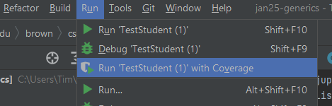
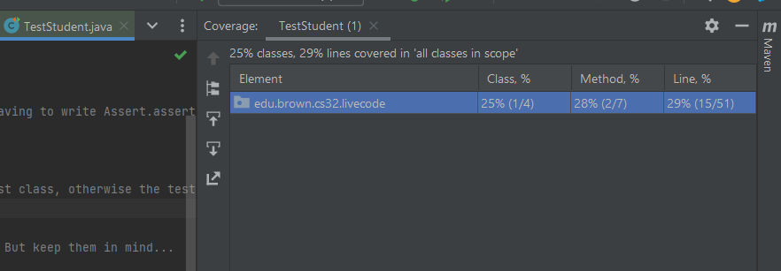

# sp24.1: Success In 0320 

## Logistics

I am sending overrides every day, according to how many seats become available. The cap is shared between all sections, including 1340. So while I'm going over cap in total, CAB is not accurately reporting this. 

**NOTE WELL:**
* If you **don't intend** to take 0320/1340, please drop (and/or remove the course from your cart) so that I see the seat and can add someone on the waitlist. 
* If you **do intend** to take the course, keep it in your cart so that I know you're interested. **I will not be giving overrides to students without 0320 in their cart** because you won't be seeing announcements, etc. that we send to the list or post on EdStem.
* **You need the prerequisites** to take 0320 or 1340. If you haven't completed an intro sequence (including at other universities), you need permission from me. This is true even if CAB isn't smart enough to flag your override request. 

## Welcome!

Welcome to 0320/1340! Before we get started, turn to the people sitting next you to now and introduce yourself. 

The most important part of 0320 is *collaboration*. With the exception of the very first assignment, everything in 0320 is group work. 
* You'll be submitting your work to repositories that everyone in the class can (eventually) read.
* You'll be helping one another solve bugs and design problems (even if you're in different project groups).
To make this work, we need a professional and friendly environment. 

We'll be passing out index cards. I like to anonymously learn some important things about students in this class, so please fill one out, answering: 
* What is a goal you have for 0320?
* What is something you're afraid of in 0320?
* What is something you need to succeed in 0320?
At the end of class, leave your card either here in front or on (one single) chair in the back so I can collect. 

### An Example: Collab Section

In 0320, we don't have "hours" in the way you may be used to---although help is available frequently! We've made learning to collaborate professionally and debug together educational goals. In industry, it's not uncommon to help colleagues improve their code, find and fix bugs, and produce reliable and extensible designs. The one-on-one debugging hours format doesn't teach those skills. So we've split "hours" into multiple formats, all of which are supported by TAs, and which you can read about in the missive.

**Speaking of TAs, let's introduce them!**

The first sprint goes out today. Go to a gearup! Attend conceptual hours! Read lecture notes and livecode! Prototype early! (Paraphrasing Andy: *Start soon! Start yesterday!*)

Please be aware that while this is an S/NC course, it is a lot of work. To quote a very wise remark from prior feedback: *"You will work very hard, but not get an A".* 

### Tim's Hours

My hours will be on Wednesdays at 1:30pm. These will usually be in [my Zoom](https://brown.zoom.us/my/tim.browncs), to maximize accessibility for those who are off-campus, sick, on the waitlist, etc. (It is possible my hours might move after shopping period.)

### Reading for Next Time

Non-technical reading: [Clever Manka](https://www.gutenberg.org/files/33002/33002-h/33002-h.htm#Page_165). It's short. 

### Reading for the CSV Sprint

_Effective Java_ items on:
* generics;
* equality/hash;
* gen contract; and 
* exceptions.

You are not required to buy this book. It's available free to read online via Brown's library. 

**Be sure to read the notes and livecode. There is useful information in them that may not be covered in class.**

## Lunchtime

Ok, now that we've talked for a while, let's...well, actually, I didn't have a chance to eat lunch. Fortunately, I've got some food items here in this bag. I have:
* a loaf of sliced bread; 
* some peanut butter (I tried to find sunflower-seed butter but couldn't in time for class); 
* some bananas; and
* a knife.

I guess I'll make a sandwich. But it's been a long time since I've made a sandwich like this, so maybe _you_ can help me remember how to make it. How should I start?

<p>
<center>
    (Chaos ensues.)
</center>
</p>

I guess that good communication matters. Good abstractions, too.

What if we took this lesson, and applied it to engineering? Let's say I asked you to open up your laptop and write me a sorting algorithm in the language of your choice. How would you react?

<details>
<summary>Think, then click.</summary>
Hopefully you didn't immediately start programming. I didn't really give you enough information, did I? I didn't say (among other things):

* what kind of values you would have to sort; 
* whether the sort needed to be stable, or in-place, or if there were any runtime requirements; or
* what the input interface should be (do you need to do file I/O or parse a CSV file?)
    
If you'd written insertion sort over lists of integers, but I needed to sort lists of records with a low worst-case runtime, you'd have had to start all over.
</details>
</br>

Get in the habit of **asking questions**.  It will save you time and pain in the future. 

Don't misunderstand me: you'll all write _lots_ of code in this class. Your career in CSCI so far has likely trained you to write a lot of code. But just writing code is, frankly, _not good enough_.

## The 0320 Mindset

Our goal is not to teach you to do better at programming courses, or even computer science courses in general. Our goal is to teach you to be a better engineer, period. That goal has some natural consequences.

**This may be the weirdest course you'll take during your time at Brown CS. That is deliberate. It will also challenge you in new ways, and that is also intentional.**

The collaboration policy is part of that. We'll use Git, an industry standard version control system. If you haven't had Git experience yet, that's OK! Here's an example of how it works on a project I just happen to have here on my laptop. By the way, I'm using IntelliJ to work on this code. This course strongly encourages you to use (and supports) IntelliJ; the gear up sections today and tomorrow can help you set it up.

One advantage of using Git is that all the code from lecture will be available on a [public repository](https://github.com/cs0320/class-livecode) in the `S24` folder. You can clone the repository to experiment with the code on your own machine. **You should clone this repository as soon as you're able**; we'll use it for in-class exercises, and it gives you the ability to experiment with changing the code on your own machine. Starting next week, I will assume that you have the repository cloned on your laptop, if you bring one. 

If a filename or package has `prep` in it, I'm including it as part of my class prep, and it likely contains spoilers for class, perhaps even intentional and unintentional bugs.

### A Little Bit of Generics

In today's project I've got a very basic `Student` class. Every `Student` has a todo list, and the contents of their todo list are passed in the constructor. 

```java
public class Student {    
    List<String> todos;
    public Student(List<String> todos) {
        this.todos = todos;
    }

    ...
    
}
```

We don't have any code yet to remove things, or add things to the list. What we do have is a method to find the _most common thing_ on the todo list. 

```java
    public String mostCommonTodoItem() {
        Map<String, Integer> counts = new HashMap<>();
        for(String s : this.todos) {
            if(!counts.containsKey(s)) counts.put(s, 1);
            else counts.put(s, counts.get(s) + 1);
        }
        String mostCommonItem = null;
        int howCommon = 0;
        for(String s : counts.keySet()) {
            if(counts.get(s) > howCommon) {
                mostCommonItem = s;
                howCommon = counts.get(s);
            }
        }
        return mostCommonItem;
    }
```

There might be more concise ways to write this, but this way is useful for what I want to demo. It breaks the problem in half:
* first, compute the number of times every item appears on the list; and 
* second, find which item had the highest count. 

Looking at this code, you might have some questions. One is whether I can really say there is _one unique_ most common item on the list. I'm making some unstated assumptions, aren't I? More on that later in the semester. 

For now, let's observe that the todo list for every student needs to contain `String` items. But there's no real reason for that. Our `mostCommonTodoItem()` method would work perfectly if we changed `String` to `Integer`. Or we changed `String` to `Object`, or even to some other more complicated type like `List<String>` (then each todo item would be its own list). But to make such a change, we need to modify _many_ places in the method, and copy it. We'd have `mostCommonTodoItem_String` and `mostCommonTodoItem_Int` and so on. That sounds like a lot of work. The code isn't _easily extensible_. 

We can fix that using Java generics more deeply. Rather than saying `List<String>`, what we want to do is speak of a list of some arbitrary type---that the method *doesn't need to care* about the details of. Let's call that arbitrary type `T` for short. Then we might say that the `Student` class has a field `List<T> todos`, and write the method this way:

```java
public T mostCommonTodoItem() {
        Map<T, Integer> counts = new HashMap<>();
        for(T s : this.todos) {
            if(!counts.containsKey(s)) counts.put(s, 1);
            else counts.put(s, counts.get(s) + 1);
        }
        T mostCommonItem = null;
        int howCommon = 0;
        for(T s : counts.keySet()) {
            if(counts.get(s) > howCommon) {
                mostCommonItem = s;
                howCommon = counts.get(s);
            }
        }
        return mostCommonItem;
    }
```

It's the same code we would have written if we'd changed `String` to some other type, except we're just plugging in this new name `T` instead. Here, `T` is called a _type variable_. **Crucially, a type variable is not a variable at runtime**. It doesn't hold a value or a reference. Instead, it's a variable that the *compiler* uses when it's reasoning about the program. We can make this code valid Java by declaring `T` in the `class` definition:

```java
public class Student<T> {
    ...
}
```

Every time we create a `Student`, that instance will have a todo list containing items of some type. That type will always have to be the same type for any specific student; that single type is the value of `T` (which only exists for the compiler). We can create students just like we would without the type variable, but we need to provide a little information, like this:

```java
Student<String> tim = new Student<>(List.of("lecture notes", "email", "email", "family", "email"));
Student<Integer> nim = new Student<>(List.of(1, 17, 3, 43, 1, 2, 5));
```
This is exactly the same thing you do when you create a new `List` or `Set` or `HashMap`! All of these data structures are implemented using type variables. They are a _great_ way to make your code easy to use and extend. (We'll revisit generics and type variables a little later in the semester, but this is as much as you need for now.)

While we're here editing this class, there's something I don't like. What happens if the list is empty? Then the method returns `null`. This feels unsafe, or at least not very communicative. We could be throwing an exception that has more meaning---like `IllegalArgumentException` (or maybe even our own exception type). I'll add this to the start of the method:

```java
        if(this.todos.isEmpty()) {
            throw new IllegalArgumentException();
        }
```

Great! So we've made 2 improvements to the code: one which makes it more generic, and one that makes it a little more useful to the program that's calling it. 

Now that we've made this change, I'll just *commit* the change to my local repository. First, I'll tell Git that I want it to include the change I just made:

```
git add Student.java
```

At any point, I can ask Git for the `status` of the repository:

```
git status
```

which can help keep track of which files are changed, added (i.e., ready to be comitted) etc.

I see the file I want to change is ready, so I'll commit the change, with a human-readable message:

```
git commit -m "feat: generic student TODO list, better error behavior"
```

So far, the change is only on my _local_ machine: in the file, but also in the repository. If I want others on staff (and all of you!) to get the change, I need to `push` to the repo:

```
git push 
```

We can see a log of commits on the Github page for the project. Each of these entries shows a commit I've made in the past. If someone else wants to review the changes I've made, they can just look at the difference between commits. This is tremendously useful for group work, and most real engineering is group work. 

Now if any of you view the repo, you'll see my change. It's that easy! Here's a sketch image of what's going on. Always keep in mind that these three things are different:
* the files on your filesystem;
* the history and current version of those files in your _local_ repository; and
* the history and current version of those files in your _remote_ repository.


As the semester progresses, we'll have expectations about your use of Git. For now, focus on your commits and pushes:
* Name your commits something informative, and give credit to anyone who pair-programmed or worked with you. (More on this in the gearup.)
* Commit and push regularly. Don't just push everything all at once on the day the sprint is due. If your laptop breaks, and you haven't pushed to Github, you will be a very unhappy person and we may not be particularly sympathetic.

In future, we'll ask you to use branches---which are a great way to develop in parallel with others. For the first sprint, working in the `main` branch is fine.

## Testing with JUnit

<p>
<center>
TA in audience: Well, uh, Tim, your code just broke some of our tests...
</center>
</p>

Oh, dear. 

Since this was an existing project, we had test cases written for it. I guess I should have run those tests _before_ pushing my update, huh? Let's have a look. Our tests use _JUnit_, a popular testing library for Java. How do we install JUnit? Just by adding it as a dependency in Maven, our Java package manager. Your Maven configuration usually lives in a single file: `pom.xml`. In my project, I have:

```xml
    <dependencies>
        <dependency>
            <groupId>org.junit.jupiter</groupId>
            <artifactId>junit-jupiter</artifactId>
            <version>RELEASE</version>
            <scope>test</scope>
        </dependency>
    </dependencies>
    <build>
        <plugins>
            <plugin>
                <groupId>org.apache.maven.plugins</groupId>
                <artifactId>maven-surefire-plugin</artifactId>
                <version>2.22.2</version>
            </plugin>
        </plugins>
    </build>
```

This loads JUnit for testing in my application. (The plugin is to help JUnit interoperate well with the build system we'll be using, Maven, which you may recall is the tool that uses this `pom.xml` file.)

I previously had this test in my suite: 

```java
    @Test
    public void emptyList() {
        Student student = new Student(List.of());        
        assertNull(student.mostCommonTodoItem());
    }
```

There are now some warnings in the test, because `Student` is now generic, and there are no angle-bracketed type parameters in my test. But we can fix those pretty easily, just by adding `<>` or `<String>` in some places. 

But the test still fails. I guess I put in a bug by mistake. But I don't really understand how, or what the problem is. How do I work through the problem?


 
## The 0320 Debugging Recipe

I think I'm supposed to follow this [debugging recipe](https://hackmd.io/UtLhJAHFRj-MbEdhQAU7TA). And why don't _you all_ help me follow it? It starts in a strange way:

#### Rule One

"Never debug when tired or angry."

I don't feel particularly angry, and I just had a sandwich. So I think I'm good to go. (This rule is not a joke, however. When you're tired and/or angry, your effectiveness per unit time goes down, and you may end up convincing yourself to make changes that are not good ideas in hindsight and make the problem even harder to fix. This is a reason to **start work ASAP**.)

#### What's Wrong?

* Assemble your knowledge. Write *no more than* two sentences for each question:
    * What is the _purpose_ of the code you're working on?
    * What _steps_ can you perform to reproduce the bug?
    * What is the _expected behavior/result_, and what is the unexpected _actual behavior/result_?
    * _Why_ do you expect the result that you expect?
* Describe how you think the system operates as it approaches the unexpected actual result. Write your description as a series of steps. Use no more than one or two sentences for each step, but each step should be testable as a hypothesis about how the system works.


Let's give it a try.
* I'm working on a method that finds the most common item in a list.
* I can reproduce the bug by running the test suite for the `Student` class. The failing test creates a `Student` instance with an empty list, and then invokes the most-common method.
* I expected this test to pass. I made the code objectively better, so tests shouldn't be failing.
* The student is created, and its `todos` field contains a reference to that empty list. Then the method is called, the empty-list check is hit, my exception gets thrown, and the test should pass.

#### Localization

Confirm each step in your description is accurate. Use any reasonable means (e.g., print statements or a debugger). The first step where the program behaves unexpectedly is a *possible location* for the original bug. More commonly, it contains the call site for the actual buggy code. 
Record this location, along with the expected and actual behavior.

* I see the student is created, and I know the method is called because I added a `println` to check.
* I see my exception is being returned, because I added a `println` to check.*

Notice how this process is leading us to the problem: that an exception being thrown is not the same as returning `null`. This is a pretty simple bug, but the process of _narrowing your attention_ through experiments is a professional technique that works even in enormous enterprise systems.

The debugging recipe has some additional prompts, mostly about what to do if you've found the location of the problem, more or less, but aren't sure how to move on from there. We'll follow the recipe in class several more times this semester!

**We expect you to follow the recipe, especially during collab section. If you were my debugging partner, my answers to those questions may have pointed you directly to the problem!**

I guess I need to rewrite my test. But wait. Isn't what we just did _cheating_? I let you see my code, and that might influence your solution to this project. 

No. In 0320, we have an open collaboration policy---even about code. But in exchange, we need you to follow some basic professional standards. Things like:
* always report and give credit to sources;
* never deliberately short-circuit someone else's learning; 
* never copy or adapt code that you can't explain (to a staff member, or me, or your partner, or yourself); and
* never copy or adapt code that you haven't tested thoroughly.

A failure to meet these basic professional standards would be a violation of Brown's academic code (it would also get you in trouble at work). To run a course with such an open policy is _risky_---if abused, it harms your learning and our ability to keep the course collaborative. I'm sorry to say that this means I would have to file an academic code case if these standards were violated, and then relentlessly pursue it.

<!-- However, I believe this policy can work well. It's realistic---the cases for violating the policy are cases any manager or tech lead would be extremely unhappy with! And since every team will have a TA serving as a manager, that's not a hypothetical. Also:

* The functionality of your code is only a small part of your evaluation in 0320. Someone who steals code, but can't test it well or explain it to another engineer, won't pass 0320. 
* You may be asked to explain every line of code in your project. This goes double for the term project, where code walks are common. Moreover, on the term project, everyone is working on something different. Someone who doesn't contribute professionally to a term project won't pass 0320.
* If that isn't enough, proceed assuming we will be running MoSS (and filtering for declared collaborations).
 -->

<!-- ### What About AI?

We'll be addressing generative AI models during the semester. You're _not_ allowed to use them for your work in 0320, except when we explicitly say so. This includes, e.g., models that produce text or images, not just code. (Think about why we might have that policy in place. It's not that the tools are "bad"; the argument is more subtle.) We will be using them some, later in the semester.

For now, *you don't need AI; you have each other.*
 -->
## How Does Grading Work?

0320 is mandatory S/NC. We _do_ give S with distinction, and distinction is based on your responses to reflection exercises and participation in discussions. The course is divided into 2 parts: the _sprints_ and the _term project_. The sprints let you demonstrate command of new technical skills (which we measure by awarding "badges"). The term project lets you show you can apply those skills in a new context of your own (and also gives you a chance to make up for _some_ badges you might not have quite earned on the sprints). The missive covers exact requirements in more detail---read it!

## Advice on Sprint 1: CSV

Let's look at the first sprint to give you an idea how we'll evaluate you. First, notice that there are 3 "user stories" we're giving you. Think of these as user-level, rough specifications for what you need to provide. Also notice that not all the users are the same. In fact, you've got a job to do for an end-user (build a CSV counter utility) but also a job for _a developer who wants to use your code_. 

The sprint lists 4 badges you can earn (and you need multiple instances of each badge throughout the semester):
* testing;
* code organization;
* patterns; and 
* defensive programming.

### Strategy Pattern

You'll write a CSV parser for this sprint. Rather than _always and only_ returning something like `List<List<String>>`, though, you'll let your caller provide a _strategy_ object that says how to convert rows to objects of their choice. Because your parser should be completely agnostic about what kind of objects get produced by this strategy, you'll make it generic over some type `T`, just like `Student` earlier in this class. Your caller---the developer user---knows what `T` is, and is happy to tell your parser how to convert rows into instances of `T`. But the details _aren't your problem_. 

It's kind of like making peanut-butter sandwiches in bulk. Maybe *my* job is assembling the sandwiches. I should be able to make a sandwich out of any kind of bread---that is, anything that implements the `Bread` interface: I can slice it, I can spread things on it, etc. Your parser should be able to make any kind of dataset, so long as your caller has given you a strategy you understand. 

We'll talk more about strategies throughout the semester, and other ways to embody them, but this should get you started. Think _generically_. Don't make unnecessary assumptions about types.

### Code Organization

Here, we're looking for three things:
* use packages; 
* document your code; and 
* use Git properly. 

Push regularly with reasonable commit messages. Don't just keep all your code in one directory. Group your classes according to which component they're part of, or according to some other sensible principle. **I shouldn't need to care about your CSV Search utility to use your CSV parser for my own, different, projects**.

### Testing

Test your code. We'll talk more about testing next week, but it should go without saying that in 0320, we take testing seriously. The handout contains *good advice* on meeting our requirements for this sprint. Future sprints may reduce the level of detail we give.

#### Test Coverage 

There are a few metrics for how good a test suite is. One is "test coverage", which measures how much of the code the suite exercises. Although we encourage you to run from the terminal using `mvn`, IntelliJ is probably the best way to get test-coverage information easily, without more configuration work. To do this, run a test file in IntelliJ, then select "Run with Coverage" from the "Run" menu:



This will open a new pane in IntelliJ:



My 3 tests for today's lecture are only exercising 29 percent of the code! That's a bit worrying. (We'll expect at least 50 percent line coverage on CSV, which should be very easy to reach.) If you click on the package name, it will show you lower-level information:


Actually, my coverage isn't bad after all. I simply don't have tests in this file for my course-prep code, or for the `Main` class. That's OK; all lines in the `Student` class are being exercised. 

~~~admonish warning title="Coverage isn't everything!"
Don't view a high level of coverage as a guarantee! Coverage is imperfect; there are a lot of things it doesn't measure. But it's one means by which you can discover problems with your testing. 

On a similar note, there's diminishing returns on time to improve coverage. In a real, large code base, it's _far_ more difficult to move from 90% to 95% than it is to move from 50% to 65%. Don't spend all your time trying to improve coverage at the exclusion of all else, but don't neglect it either. Our sprints are small, compared to most real-world projects!
~~~


### Defensive Programming

This badge also includes error handling. Make sure you're handling error cases in a reasonable way. E.g., what happens if the code calling your CSV parser gives an invalid file name? (And numerous other scenarios...)

Keep in mind: you probably don't want to print an error message and exit as part of your CSV parser. Be considerate of the code calling yours---maybe they want to do something for error cases. For more advice on this, see _Effective Java_ on exceptions.
